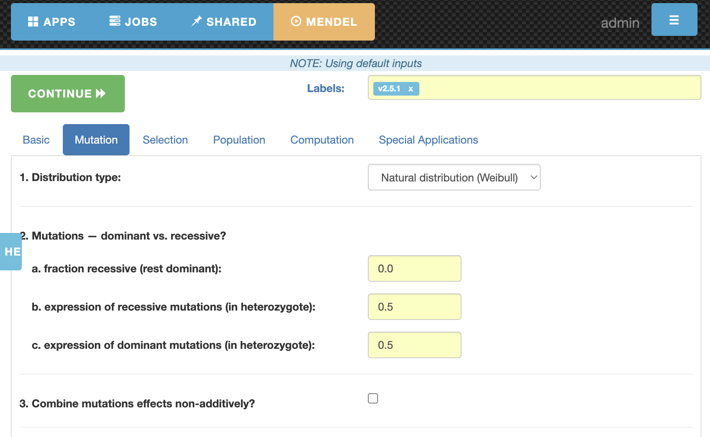
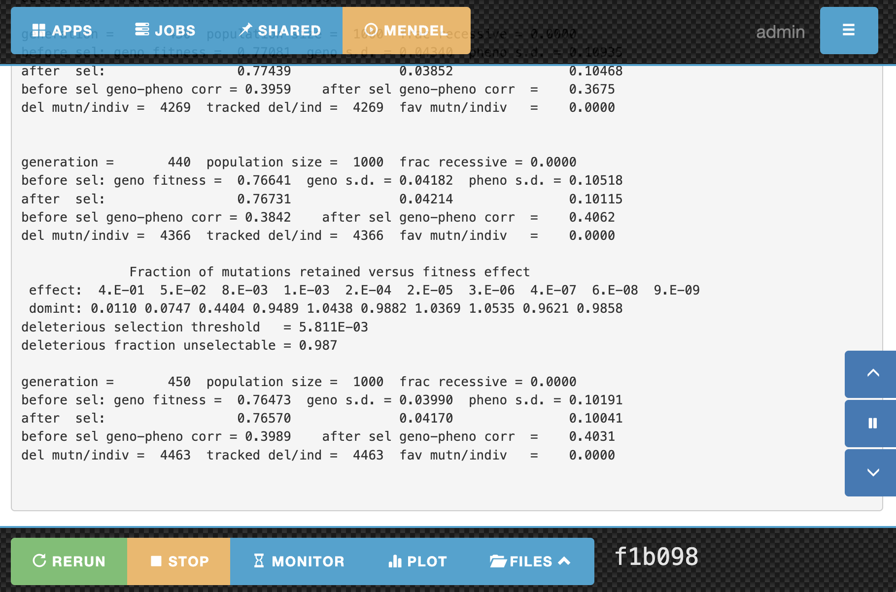
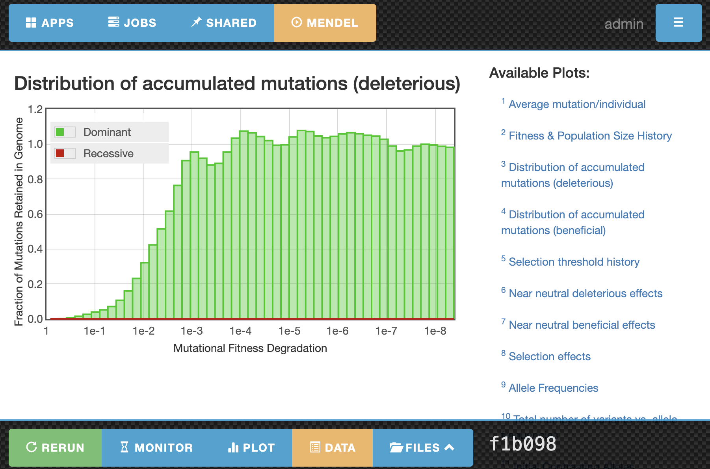

# SPC — Scientific Platform for the Cloud

[](https://www.python.org/)
[](http://spc.readthedocs.io)

> Note: See `NOTES.md` for important release notes.

Full documentation is available online at: http://spc.readthedocs.io  
Minimum Python requirement: **3.8** (tested on **3.12**).

---

## Overview

The **Scientific Platform for the Cloud (SPC)** is a Python-based platform/framework for rapidly migrating and running **scientific applications** in the cloud. SPC provides a web UI and workflow scaffolding for running parameterized simulations, tracking cases, managing files, executing jobs through a scheduler, and visualizing results (including plotting) in a standardized and repeatable way.

This repository contains the **Python 3 modernization** of SPC, built with:
- **Flask + Jinja2** (web UI stack)
- **pydal** (data layer)
- **boto3** (AWS integration)

The original Python 2 / Bottle implementation is archived in the `legacy` branch:
https://github.com/whbrewer/spc/tree/legacy

---

## Features (High-level)

- Web-based UI for launching and monitoring scientific workflows
- Standardized parameter entry and input deck generation
- Case management and file management per run
- Job submission and output redirection
- Plot definitions and result visualization
- Packaged “apps” that can be installed into SPC

---

## Best fit / Intended use

SPC is ideally suited for scientific applications that:

1. Use an **input deck** of common parameter types (ints, floats, strings, booleans) stored in standardized formats such as:
   - INI, XML, JSON, YAML, TOML, or `Namelist.input`
2. Require **non-trivial runtime** (though instantaneous jobs are supported)
3. Produce **plots** and/or structured results
4. Use **MPI** or MapReduce for parallelization (serial workflows are also supported)

Other applications may be supported with additional pre-/post-processing.

---

## Screenshots





---

## Requirements

SPC assumes the following are available on your system:

### System prerequisites
- Python **3.8+**
- `virtualenv` (or equivalent environment tooling)
- A compiler toolchain (`gcc` / `clang`)
- Python development headers (required to build packages such as `psutil`)
  - Debian/Ubuntu: `python3-dev`
  - RHEL/CentOS: `python3-devel`

### Browser support
SPC has been tested primarily with **Google Chrome** on Linux and macOS. Other environments may work but are not guaranteed.

---

## Quickstart

Initialize SPC (installs dependencies and initializes the SPC database):

```bash
./spc init
```

Start the web server:

```bash
./spc run
```

Open your browser at:

- http://localhost:8580/

> Note: Port can be overridden in `config.py`.

## Headless (CLI) mode

You can run SPC without the web UI using the CLI.

### Basic CLI commands

```bash
# Submit a job
./spc submit dna --params "dna=ATCGATCGATCG" --desc "my experiment"

# Run the scheduler in a separate terminal
./spc scheduler

# Check status
./spc status <case_id>

# List cases
./spc cases              # all recent cases
./spc cases dna          # cases for dna app
./spc cases --state R    # running jobs only

# Share/unshare cases (makes them visible in web UI)
./spc share <case_id>
./spc unshare <case_id>
```

### Quick headless demo (DNA)

```bash
./spc submit dna --params "dna=ATCGATCG"
./spc scheduler
./spc status <case_id>
cat user_data/cli/dna/<case_id>/dna.out
```

### MCP server (HTTP)

Run the MCP server for agent tool access:

```bash
./spc mcp
```

Minimum Python version is 3.11 for the MCP SDK.

Install MCP into your current environment:

```bash
pip install git+https://github.com/modelcontextprotocol/python-sdk.git
pip install -r requirements.txt
```

Codex config example (`~/.codex/config.toml`):

```toml
[mcp_servers.spc]
url = "http://127.0.0.1:7333/mcp"
```

For Claude Code, the MCP server is setup in .mcp.json or by running:
```bash
claude mcp add --transport http drai http://127.0.0.1:7333/mcp
```

Also, it was necessary to add the following in ~/.bashrc or ~/.zshrc:


```bash
export NODE_TLS_REJECT_UNAUTHORIZED=0
```

List available tools:

```bash
scripts/mcp_tools.sh
```

Run the DNA tool over MCP:

```bash
scripts/mcp_call.sh http://127.0.0.1:7333/mcp run_dna '{"params":{"dna":"ATCGATCG"}}'
```

### Interactive REPL

For an interactive session, use:

```bash
./spc shell
```

The shell provides these commands:

```
apps                          list installed apps
submit <app> [params]         submit a job (params: key=val,key2=val2)
status [cid]                  show job status (or all if no cid)
cases [app] [--all]           list cases
share <cid>                   share a case (visible in web UI)
unshare <cid>                 unshare a case
start                         start the scheduler
stop                          stop the scheduler
tail <cid>                    show output of a case
help                          show help
quit                          exit the shell
```

Example REPL session:

```
$ ./spc shell
SPC Interactive Shell
Type 'help' for available commands, 'quit' to exit

spc> apps
NAME            FORMAT     DESCRIPTION
-----------------------------------------------------------------
dna             ini        Compute reverse complement, GC content...

spc> submit dna dna=ATCGATCG
Submitted: cid=yf00b1 jid=1

spc> start
Scheduler started

spc> status yf00b1
Case yf00b1: Done (dna)

spc> tail yf00b1
string is:  ATCGATCG
Reverse complement is:  CGATCGAT
%G+C is: 50.0
...

spc> quit
Goodbye!
```

## How the scheduler works
1. `spc submit` queues a job (`state='Q'`) in the database.
2. `spc scheduler` polls for queued jobs, marks them running (`state='R'`), and runs the app command in the case directory.
3. Output is redirected to `<app>.out`; completed jobs are marked `state='C'`.
4. Max concurrent jobs honors `config.np`.

---

## Run the pre-installed example: DNA Analyzer

1. **Activate App**  
   Navigate to `Apps` → `Installed`.  
   Click **Activate** for the DNA app, then return to `Activated`.

2. **Enter Parameters**  
   Open the `dna` app and enter a DNA string (or use the default).  
   Click `confirm` to write the datafile to disk.

3. **Start Job**  
   Click `execute` to run the DNA analysis.  
   SPC will submit the job to the scheduler and redirect to the output view.

4. **Inspect Outputs**  
   Use `files` to open the file manager.  
   Use `output` to view redirected executable output.  
   Use `download` to zip and download all case files.

5. **View Plots**  
   Click `plot` to define/view plots.  
   Use `data` to view the plotted data files (also visible via `files`).

---

## Install packaged apps

To install an SPC packaged app (example: Mendel’s Accountant), run one of:

### macOS (Apple Silicon)
```bash
./spc install https://github.com/whbrewer/spc-fmendel-plugin/releases/download/v2.0.1/fmendel-spc-darwin-arm64.zip
```

### Linux (x86_64)
```bash
./spc install https://github.com/whbrewer/spc-fmendel-plugin/releases/download/v2.0.1/fmendel-spc-linux-x86_64.zip
```

---

## Documentation

- Online documentation: http://spc.readthedocs.io
- Local docs: see the `docs/` directory

---

## Developer setup (minimal)

A lightweight development workflow:

1. Clone the repo and enter it:
```bash
git clone https://github.com/whbrewer/spc.git
cd spc
```

2. Initialize SPC:
```bash
./spc init
```

3. Run the server:
```bash
./spc run
```

4. Open:
- http://localhost:8580/

### Running tests

Tests use pytest and run against a temporary database (no server required):

```bash
# Run all tests
./venv/bin/pytest tests/ -v

# Run a single test file
./venv/bin/pytest tests/test_login.py -v

# Run a single test
./venv/bin/pytest tests/test_login.py::TestLogin::test_login_valid_credentials -v
```

Test coverage includes:
- Login, registration, and authentication routes
- App display, parameter submission, and job execution
- Admin routes and app configuration
- Job scheduler operations
- Input file format parsers (INI, JSON, YAML, Namelist)

---

## Contributing

Contributions are welcome.

Suggested workflow:
1. Fork the repo
2. Create a feature branch
3. Make changes with clear commit messages
4. Add/update documentation where needed
5. Open a Pull Request

If you plan to contribute a new packaged app/plugin, please include:
- A small example input deck
- A minimal runnable executable or script stub
- One representative plot/output artifact

---

## Citation

If you use SPC in academic work, please cite:

> W. Brewer, W. Scott, and J. Sanford, “An Integrated Cloud Platform for Rapid Interface Generation, Job Scheduling, Monitoring, Plotting, and Case Management of Scientific Applications”, Proc. of the International Conference on Cloud Computing Research and Innovation, Singapore, IEEE Press, October 2015, pp. 156–165. DOI: 10.1109/ICCCRI.2015.24

---

## Support / Questions

For questions, contact [Wes Brewer](https://www.ornl.gov/staff-profile/wes-h-brewer).
